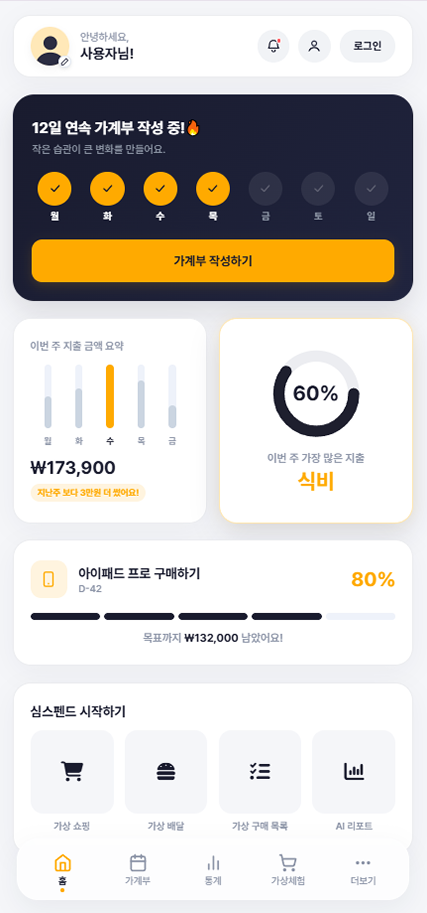
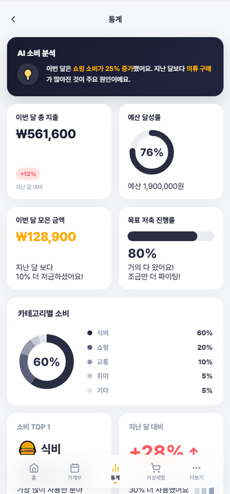
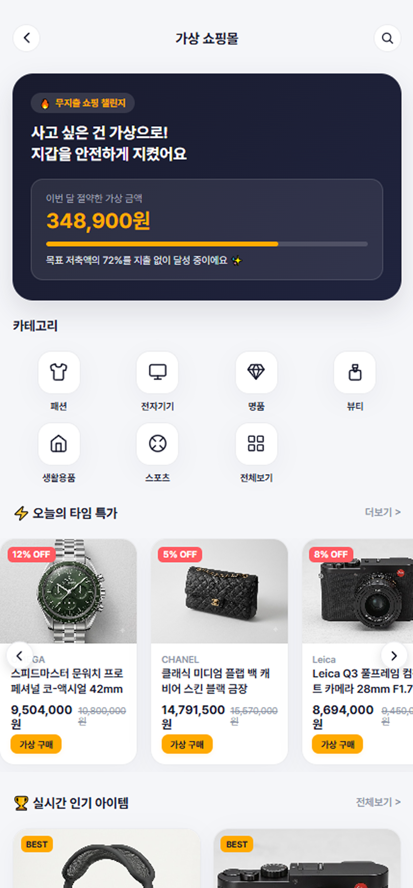
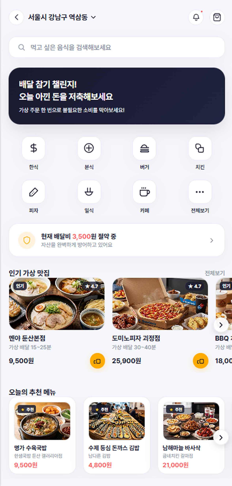
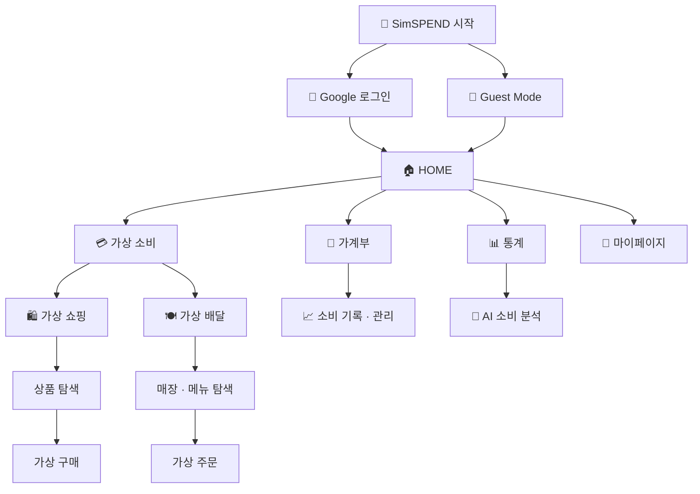

<div align="center">

# 💳 SimSPEND

### 사고 싶은 순간, 결제 대신 가상 소비로 한 번 더 생각하게 만드는
## **새로운 소비 습관 관리 서비스**

<br>

[](https://simspend.vercel.app/)
[](https://github.com/zinnnnooooo/simspend)

<br>


</div>

<br>

---

## 💡 Project Overview

### **돈을 쓰고 난 뒤가 아니라, 돈을 쓰기 전부터 관리합니다.**

**SimSPEND**는 소비가 발생한 뒤 기록하는 기존 가계부에서 벗어나,  
**돈을 쓰기 전부터 소비를 관리하는 새로운 소비 습관 관리 서비스**입니다.

사고 싶은 상품이나 음식이 생겼을 때 바로 결제하는 대신,  
**가상 쇼핑과 가상 배달**을 통해 소비를 한 번 더 경험하고 고민할 수 있도록 설계했습니다.

이를 통해 **충동구매와 불필요한 소비를 줄이고 올바른 소비 습관을 형성**할 수 있으며,  
간편한 가계부 작성과 소비 통계 기능을 통해 실제 지출까지 손쉽게 관리할 수 있습니다.

> ### **기록은 소비가 끝난 뒤 시작되지만, SimSPEND의 소비 관리는 결제하기 전부터 시작됩니다.**

<br>

### 🔍 기존 가계부와 무엇이 다른가요?

| | **기존 가계부** | **SimSPEND** |
|:---:|---|---|
| **관리 시점** | 소비가 발생한 **이후** | 소비가 발생하기 **이전부터** |
| **소비 흐름** | 소비 → 기록 → 분석 | 구매 욕구 → 가상 소비 → 고민 → 소비 결정 → 기록 → 분석 |
| **핵심 역할** | 이미 사용한 돈을 관리 | 불필요한 소비 예방 + 실제 지출 관리 |
| **관리 방식** | **사후 관리 중심** | **사전 + 사후 관리** |

<br>

---

## 🎯 Problem

### **기록만으로 충동구매를 막을 수 있을까?**

대부분의 가계부 서비스는 **이미 사용한 돈을 기록하고 분석하는 것**에 집중합니다.  
하지만 충동적인 소비는 결제가 이루어진 뒤 기록하는 것만으로는 막기 어렵습니다.

SimSPEND는 여기서 한 가지 질문으로 시작했습니다.

> ### **“소비한 뒤 기록하는 것이 아니라, 소비하기 전에 한 번 더 생각하게 만들 수 없을까?”**

<br>

**01. 💸 소비 이후에 시작되는 관리**  
소비 기록은 대부분 결제가 끝난 뒤 이루어집니다.

**02. ⚡ 순간적인 구매 욕구**  
사고 싶은 순간에는 장기적인 소비 계획을 떠올리기 어렵습니다.

**03. 🚫 지속하기 어려운 단순 절제**  
단순히 소비를 참는 방식만으로는 올바른 소비 습관을 지속하기 어렵습니다.

<br>

---

## 💡 Solution

### **소비를 참는 대신, 먼저 가상으로 경험합니다.**

SimSPEND는 소비를 무조건 제한하는 대신  
**실제 결제 전에 가상으로 소비해보는 경험**을 제공합니다.

```text
💭 사고 싶은 순간
        ↓
🛍️ 가상 쇼핑 · 🍽️ 가상 배달
        ↓
💳 실제 결제 없이 소비 경험
        ↓
🤔 한 번 더 구매를 고민
        ↓
✅ 실제 소비 결정
        ↓
📝 가계부 · 📊 소비 통계
        ↓
🌱 올바른 소비 습관 형성
```

가상 소비와 실제 지출 관리를 하나의 서비스 안에 연결해  
**충동구매를 줄이는 과정부터 소비 이후의 기록과 분석까지** 이어지도록 설계했습니다.

<br>

---

## 📱 Preview

### **SimSPEND의 핵심 화면**

<table>
  <tr>
    <th width="50%">🏠 HOME</th>
    <th width="50%">📊 STATISTICS</th>
  </tr>
  <tr>
    <td></td>
    <td></td>
  </tr>
  <tr>
    <td align="center"><b>소비 현황과 주요 기능을 한눈에 확인하는 메인 대시보드</b></td>
    <td align="center"><b>소비·예산·카테고리별 지출을 확인하는 통계 화면</b></td>
  </tr>
</table>

<br>

<table>
  <tr>
    <th width="50%">🛍️ VIRTUAL SHOPPING</th>
    <th width="50%">🍽️ VIRTUAL DELIVERY</th>
  </tr>
  <tr>
    <td></td>
    <td></td>
  </tr>
  <tr>
    <td align="center"><b>사고 싶은 상품을 실제 결제 없이 경험하는 가상 쇼핑</b></td>
    <td align="center"><b>배달 주문 전 한 번 더 소비를 고민하는 가상 배달</b></td>
  </tr>
</table>

<br>

---

## ✨ Key Features

### 🛍️ **01. Virtual Shopping — 가상 쇼핑**

실제 쇼핑몰처럼 상품을 탐색하고 상세 정보를 확인한 뒤 **가상 구매 과정**을 경험할 수 있습니다.  
실제 결제 전에 구매 욕구를 한 번 더 점검할 수 있도록 구성했습니다.

<br>

### 🍽️ **02. Virtual Delivery — 가상 배달**

배달 음식을 주문하고 싶은 순간에도 동일한 **가상 소비 경험**을 제공합니다.  
매장과 메뉴를 탐색하고 가상 주문 과정을 거치며 즉흥적인 배달 소비를 다시 고민할 수 있습니다.

<br>

### 📊 **03. Statistics — 소비 통계**

월별 지출, 예산 달성률, 카테고리별 소비 비중 등 **소비 흐름을 시각적으로 확인**할 수 있습니다.  
그래프 애니메이션을 적용해 주요 데이터를 직관적으로 파악할 수 있도록 구성했습니다.

<br>

### 🤖 **04. AI Report — AI 소비 분석**

소비 데이터를 바탕으로 사용자의 소비 흐름을 요약해 보여주는 **AI Report 화면**을 구성했습니다.  
숫자만 확인하는 데서 그치지 않고 소비 패턴을 보다 쉽게 이해할 수 있도록 설계했습니다.

<br>

### 📝 **05. Ledger — 가계부 & 소비 목표**

직접 지출 내역을 기록하고 소비 목표를 확인할 수 있습니다.  
가상 소비 기능과 실제 가계부 기능을 연결해 **소비 전후를 하나의 흐름으로 관리**합니다.

<br>

### 🔐 **06. Authentication — Google 로그인 & Guest Mode**

**Firebase Authentication**을 활용한 Google 로그인을 지원합니다.  
로그인 없이 서비스를 먼저 체험할 수 있는 **Guest Mode**도 함께 제공해 접근 부담을 낮췄습니다.

<br>

### 🌙 **07. Theme & Responsive UI**

Light / Dark Theme 구조와 모바일 중심의 인터페이스를 적용하고,  
하단 네비게이션을 통해 주요 기능으로 빠르게 이동할 수 있도록 구성했습니다.

<br>

---

## 🧭 User Flow

### **소비 전부터 소비 후까지 이어지는 하나의 흐름**



<br>

---

## 🛠️ Tech Stack

### **Design부터 Deploy까지**

| **Category** | **Stack** |
|---|---|
| ⚛️ **Frontend** | React 18 · TypeScript |
| ⚡ **Build** | Vite |
| 🎨 **Styling** | styled-components |
| 🧭 **Routing** | React Router |
| 🔐 **Authentication** | Firebase Authentication |
| 🖌️ **Design** | Figma |
| ☁️ **Deployment** | Vercel |
| 🗃️ **Version Control** | GitHub |
| 🤖 **AI Collaboration** | ChatGPT · Gemini · Claude · Antigravity |

<br>

---

## 🤖 AI Vibe Coding Process

### **AI에게 맡기는 것이 아니라, AI와 함께 반복했습니다.**

SimSPEND는 **기획 → 디자인 → 개발 → 디버깅 → 배포** 전 과정에서 AI와 협업한 바이브코딩 프로젝트입니다.

AI가 생성한 결과를 그대로 사용하는 것이 아니라  
**원하는 결과와 실제 구현 화면의 차이를 확인하고, 요구사항을 다시 정의하는 과정**을 반복했습니다.

```text
💡 IDEA
   ↓
🎨 FIGMA
   ↓
💬 PROMPT
   ↓
🤖 AI CODING
   ↓
🧪 TEST
   ↓
🔍 FEEDBACK
   ↓
🛠️ REFACTOR
   ↓
🚀 DEPLOY
```

<br>

### 💡 **① Planning — 아이디어를 서비스 구조로**

초기 아이디어를 정리하고 기존 가계부와 차별화되는 핵심 경험을 정의했습니다.  
단순한 지출 기록이 아니라 **'결제 전에 소비를 시뮬레이션한다'**는 방향으로 서비스의 핵심 컨셉을 구체화했습니다.

<br>

### 🎨 **② UX/UI — Figma + AI**

서비스 컨셉을 바탕으로 Figma에서 화면 구조와 UI를 설계했습니다.  
구현 이후에도 실제 화면을 확인하며 **컴포넌트 크기, 정보 우선순위, 하단 네비게이션, 통계 카드 구조** 등을 반복적으로 수정했습니다.

<br>

### 💻 **③ Development — 자연어에서 코드로**

완성된 디자인을 기준으로 원하는 화면과 인터랙션을 자연어로 설명하며 구현했습니다.

> **요구사항 작성 → 코드 생성 → 실행 → 문제 확인 → 프롬프트 수정 → 재구현**

이 과정을 반복하며 디자인과 기능의 완성도를 높였습니다.

<br>

### 🔐 **④ Feature Expansion — Firebase**

초기 UI 구현 이후 **Firebase Authentication**을 연결해 Google 로그인과 로그아웃 기능을 추가했습니다.  
로그인하지 않은 사용자도 주요 기능을 체험할 수 있도록 **Guest Mode**를 함께 구성했습니다.

<br>

### 🚀 **⑤ Deploy — GitHub → Vercel**

프로젝트를 GitHub Repository로 관리하고 **Vercel을 통해 실제 웹 환경에 배포**했습니다.  
로컬 프로토타입에서 끝내지 않고 직접 접속해 사용할 수 있는 서비스 형태까지 구현했습니다.

<br>

---

## 💬 Prompt Examples

### **실제 작업에서 사용한 AI 협업 방식**

### 🎨 **Design Prompt**

> **목표:** 기존 디자인 시스템을 유지하면서 정보 우선순위를 재설계

```text
현재 SimSPEND의 디자인 시스템은 유지하면서
통계 페이지에서 AI 분석 카드를 가장 상단으로 이동해줘.

AI 분석 영역은 다른 카드보다 중요도가 높아 보이도록
차콜 컬러를 사용해 강조하고,
기존 카드의 radius와 spacing 규칙은 유지해줘.
```

<br>

### 💻 **Development Prompt**

> **목표:** 기존 기능을 유지하면서 Firebase 인증 기능 확장

```text
Firebase Google 로그인을 구현해줘.

로그인하지 않은 사용자에게는
Google 로그인과 로그인 없이 사용하기 두 가지 선택지를 제공하고,

게스트 사용자는 기존 가계부, 통계,
가상 구매 기능을 그대로 사용할 수 있게 유지해줘.
```

<br>

### 🩹 **Debugging Prompt**

> **목표:** 기존 UI를 변경하지 않고 라우팅 오류 해결

```text
홈으로 이동하면 화면이 흰색으로 표시되고
새로고침해야 정상적으로 렌더링되는 문제가 있어.

React Router 구조를 확인하고
현재 디자인과 기존 기능은 변경하지 않은 상태에서
원인을 찾아 수정해줘.
```

<br>

---

## 🩹 Troubleshooting

### **구현 과정에서 마주친 문제와 해결 방향**

| **Issue** | **Problem** | **Solution** |
|---|---|---|
| 🏠 **홈 이동 시 흰 화면** | 페이지 이동 후 정상 렌더링이 되지 않는 현상 | React Router 및 화면 전환 로직 점검 |
| 🔐 **로그인/로그아웃 상태** | 인증 상태와 화면 상태 동기화 필요 | Firebase Auth 상태를 기준으로 인증 흐름 구성 |
| 📊 **그래프 렌더링** | 그래프 애니메이션 Hook 참조 오류 | Hook 호출 및 컴포넌트 구조 점검·수정 |
| 🎨 **styled-components 경고** | 스타일 선언 및 로딩 과정에서 경고 발생 | 스타일 구조와 선언 방식 정리 |
| ☁️ **배포 환경 인증** | 로컬·배포 환경의 Firebase 설정 차이 | Firebase 설정 및 Vercel 환경 변수 구성 점검 |

<br>

---

## 🗂️ Project Structure

### **주요 디렉터리 구조**

```text
simspend/
├── src/
│   ├── components/
│   ├── context/
│   ├── data/
│   ├── firebase/
│   ├── hooks/
│   ├── pages/
│   ├── styles/
│   ├── App.tsx
│   └── main.tsx
├── package.json
├── tsconfig.json
└── vite.config.ts
```

<br>

---

## 📝 What I Learned

### **좋은 바이브코딩은 좋은 요구사항에서 시작됩니다.**

SimSPEND를 만들면서 AI를 단순히 코드를 생성하는 도구가 아니라  
**기획부터 디자인, 개발, 디버깅까지 함께 반복 작업하는 협업 도구**로 활용했습니다.

특히 원하는 결과를 얻기 위해서는 단순히 결과만 요청하는 것보다 다음 네 가지를 명확하게 정의하는 것이 중요했습니다.

> **✓ 유지해야 할 요소**  
> **✓ 변경해야 할 요소**  
> **✓ 원하는 동작 방식**  
> **✓ 예외 조건**

또한 AI가 생성한 결과를 그대로 사용하는 것이 아니라  
**실제 화면에서 직접 검증하고 문제를 다시 정의하는 과정이 바이브코딩 결과물의 완성도를 결정한다**는 점을 배웠습니다.

<br>

---

## 🔗 Links

### **Project 바로가기**

- **Live Demo**  
  [어플리케이션 바로가기](https://simspend.vercel.app/)

- **GitHub Repository**  
  [깃허브 바로가기](https://github.com/zinnnnooooo/simspend)

- **Figma Design**  
  [피그마 바로가기](https://www.figma.com/design/dQ4JRCKvYUIy87vlD53fb1/%EC%8B%AC-%EC%8A%A4%ED%8E%9C%EB%93%9C?node-id=0-1&t=zvbK7K8nWk0isIwc-1)

- **Note Folio**  
  [노트폴리오 바로가기](https://notefolio.net/parkings/466196)

<br>

---

## © Copyright

**© 2026 Jinho Park. All rights reserved.**
