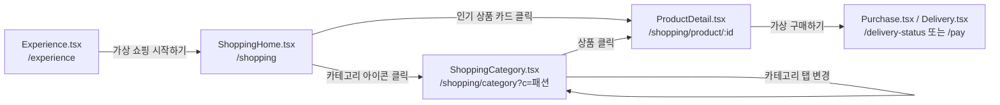

# 가상 쇼핑 페이지 변환 작업계획서 (SimSPEND)

본 계획서는 `org/` 폴더에 퍼블리싱된 원본 리소스(`shopping_home`, `shpping_category.html`, `product_detail.html` 및 관련 CSS/JS)를 분석하여, 기존 React 프로젝트(`D:\박진호\project0001`)에 가상 쇼핑 체험 플로우(3개 페이지)를 안전하게 마이그레이션하기 위한 기술 설계 및 작업 지침서입니다.

---

## 1. 프로젝트 개요 및 원본 분석

### 1.1 환경 및 기술 스택
- **프로젝트 경로**: `D:\박진호\project0001`
- **퍼블리싱 원본**: `org/` (또는 `publising/org/`)
- **프론트엔드 프레임워크**: React 18 (Vite + TypeScript)
- **라우팅**: React Router DOM (v6)
- **스타일링**: styled-components (CSS-in-JS, ThemeProvider 기반)
- **상태 관리**: React Context API (`LedgerContext`, `ThemeContext`)

### 1.2 변환 대상 원본 매핑
| 원본 파일 (org/) | 변환 대상 React 파일 | 역할 및 핵심 기능 |
| :--- | :--- | :--- |
| **`shopping_home`** (HTML/CSS/JS) | `src/pages/ShoppingHome.tsx` | - 챌린지 배너 & 이번 달 아낀 금액 위젯<br>- 카테고리 퀵 아이콘 그리드<br>- 트렌딩 핫딜 & 카테고리별 추천 가상 아이템 리스트 |
| **`shpping_category.html`** (HTML/CSS/JS) | `src/pages/ShoppingCategory.tsx` | - 카테고리 탭 바 (패션, 전자기기, 뷰티, 생활용품 등)<br>- 필터/정렬 (추천순, 할인율순, 낮은가격순, 인기순)<br>- 상품 카드 그리드/리스트 렌더링 |
| **`product_detail.html`** (HTML/CSS/JS) | `src/pages/ProductDetail.tsx` | - 상품 이미지, 태그, 정가/할인가/할인율 계산<br>- 컬러/옵션 선택 드롭다운/칩, 수량 증감 조절<br>- 상품 상세 설명/스펙/가상 리뷰 탭<br>- "가상 구매하기" 버튼 클릭 시 구매 처리 및 플로우 이동 |

---

## 2. 전체 이동 흐름 (User Flow & Routing)



### 2.1 라우팅 매핑 테이블
| 라우트 경로 | 컴포넌트 | 파라미터 / 쿼리 스트링 | 설명 |
| :--- | :--- | :--- | :--- |
| `/shopping` | `ShoppingHome` | 없음 | 가상 쇼핑 메인 홈 |
| `/shopping/category` | `ShoppingCategory` | `?c={categoryName}` (기본값: '패션') | 카테고리별 상품 목록 및 필터 |
| `/shopping/product/:id` | `ProductDetail` | `id` (상품 고유 ID) | 상품 상세 정보 및 가상 구매 주문창 |

---

## 3. 디렉토리 구조 및 파일 변경 계획

```
src/
├── @types/
│   └── index.d.ts                  # [수정] ShoppingProduct, ProductOption 등 타입 추가
├── components/
│   ├── Layout.tsx                  # [유지/재사용] 모바일 430px 프레임 및 공통 레이아웃
│   └── BottomNav.tsx               # [절대 수정 금지] 기존 하단 네비게이션 유지
├── context/
│   ├── LedgerContext.tsx           # [재사용] addVirtualPurchase 전역 액션 연동
│   └── ThemeContext.tsx            # [재사용] 다크모드/라이트모드 테마 지원
├── data/
│   ├── mockStores.ts               # [유지] 기존 배달 데이터
│   └── mockProducts.ts             # [신규 생성] 가상 쇼핑 카테고리별 상품 목데이터
├── pages/
│   ├── Experience.tsx              # [최소 수정] '가상 쇼핑 시작하기' 링크를 /shopping으로 변경
│   ├── ShoppingHome.tsx            # [신규 생성] 가상 쇼핑 홈
│   ├── ShoppingCategory.tsx        # [신규 생성] 쇼핑 카테고리 목록
│   ├── ProductDetail.tsx           # [신규 생성] 상품 상세 및 구매
│   └── (기존 페이지들)              # [수정 금지] Dashboard, Ledger, Statistics, Target 등
├── styles/
│   ├── GlobalStyle.ts              # [유지]
│   └── theme.ts                    # [유지/재사용] 디자인 토큰 사용
├── App.tsx                         # [최소 수정] 신규 3개 라우트 등록 (/shopping/*)
└── main.tsx                        # [유지]
```

---

## 4. 데이터 모델 및 목데이터 설계

### 4.1 신규 타입 정의 (`src/@types/index.d.ts`)
```typescript
// 상품 옵션 항목
export interface ProductOptionItem {
  name: string;
  priceDelta?: number; // 옵션 추가금
}

// 상품 옵션 그룹 (예: 색상, 사이즈)
export interface ProductOptionGroup {
  name: string;
  options: ProductOptionItem[];
}

// 가상 상품 인터페이스
export interface ShoppingProduct {
  id: string;
  name: string;
  category: '패션' | '전자기기' | '생활용품' | '뷰티' | '취미' | '도서' | '스포츠' | '전체';
  brand: string;
  originalPrice: number;
  discountRate: number; // 할인율 (%)
  price: number;        // 실제 판매가
  savedAmount: number;  // 절약/아낀 금액 (originalPrice - price)
  image: string;
  badge?: 'BEST' | 'HOT' | 'SALE' | '추천';
  rating: number;
  reviewCount: number;
  colors?: string[];
  options?: ProductOptionGroup[];
  description: string;
  specs?: { label: string; value: string }[];
  reviews?: {
    id: string;
    author: string;
    rating: number;
    date: string;
    content: string;
  }[];
}
```

### 4.2 목데이터 파일 생성 (`src/data/mockProducts.ts`)
- 카테고리별 현실감 있는 가상 상품 데이터 정의 (에어팟 맥스, 친환경 텀블러, 오버핏 맨투맨, 세럼 세트 등)
- 고해상도 더미 이미지 및 기존 `design/airpods-max.jpg` 등 리소스 연계
- 셔플 헬퍼 함수(`shuffleArray`) 및 카테고리/ID 기반 조회 유틸 함수 제공:
  - `getProductById(id: string): ShoppingProduct | undefined`
  - `getProductsByCategory(category: string): ShoppingProduct[]`
  - `getFeaturedProducts(limit?: number): ShoppingProduct[]`

---

## 5. 페이지별 세부 구현 및 변환 계획

### 5.1 `ShoppingHome.tsx` (가상 쇼핑 홈)
1. **HTML → JSX 구조 변환**:
   - 상단 헤더: 뒤로가기 (`/` 또는 `/experience`), 타이틀("가상 쇼핑"), 장바구니/검색 액션
   - 챌린지 배너 & 절약 금액 카드: 이번 달 가상 쇼핑으로 절약한 누적 금액 시각화
   - 카테고리 퀵 네비게이션: 8개 카테고리 아이콘 그리드 (`/shopping/category?c=...` 링크)
   - 트렌딩 핫딜 섹션: 높은 할인율의 대표 상품 가로 스크롤 카드
   - 실시간 인기 랭킹 상품 그리드: 2열 그리드 형태의 상품 리스트
2. **CSS → styled-components 변환**:
   - `theme.colors.cardBackground`, `theme.colors.textPrimary` 등 테마 토큰 완벽 바인딩
   - 카드 호버 및 탭 시 부드러운 스케일 애니메이션 (`transform: translateY(-2px)`)
3. **JS → React 로직 변환**:
   - 상태: `featuredProducts`, `hotDealProducts` (`useState`, `useEffect`)
   - 상품 카드 클릭 시 `navigate('/shopping/product/' + product.id)`

### 5.2 `ShoppingCategory.tsx` (쇼핑 카테고리)
1. **HTML → JSX 구조 변환**:
   - 상단 헤더: 뒤로가기 (`/shopping`), 현재 카테고리 타이틀, 검색창 트리거
   - 캡슐 형태의 가로 스크롤 카테고리 탭: 활성 카테고리 하이라이트 표시
   - 필터/정렬 바: '추천순', '할인율높은순', '낮은가격순', '평점순' 정렬 칩
   - 상품 리스트/그리드: 총 N개 상품 카운트 및 상품 카드 렌더링 (빈 결과 대응 EmptyState 포함)
2. **JS → React 로직 변환**:
   - URL 쿼리 파라미터 연동: `const [searchParams, setSearchParams] = useSearchParams();`
   - 카테고리 변경 시 쿼리 파라미터 동기화 (`?c=...`)
   - 정렬 상태(`activeSort`)에 따른 클라이언트 정렬 (`sort()`) 로직

### 5.3 `ProductDetail.tsx` (상품 상세 및 가상 구매)
1. **HTML → JSX 구조 변환**:
   - 헤더: 뒤로가기 (히스토리 뒤로가기 `navigate(-1)`), 공유/찜 아이콘
   - 상품 갤러리/메인 이미지: 할인율 뱃지, 브랜드명, 상품명, 가격 표시
   - 옵션 선택기:
     - 컬러 선택: 원형 컬러 칩 버튼 (활성 상태 보더 표시)
     - 옵션 드롭다운 또는 선택 박스
     - 수량 조절기: `[-]` `수량` `[+]` 버튼
   - 탭 메뉴: 상품 상세 정보, 제품 스펙, 구매 리뷰 (탭 전환 상태 관리)
   - 하단 고정 CTA 바: 총 결제 금액 계산 (`price * quantity`), "가상 구매하기" 버튼
2. **JS → React 로직 및 Context 연동**:
   - `useParams`를 통해 `id` 추출 및 `getProductById(id)` 조회
   - "가상 구매하기" 클릭 시:
     - `LedgerContext`의 `addVirtualPurchase` 호출하여 구매 이력 기록
     - 가상 배송 추적 화면(`/delivery-status`)으로 이동 및 토스트/축하 피드백 제공

---

## 6. 라우팅 연결 계획 (`src/App.tsx`)

기존 `App.tsx`의 `<Layout />` 하위 자식 라우트에 쇼핑 관련 3개 라우트를 안전하게 추가합니다.

```tsx
// src/App.tsx (라우트 추가 계획)
import { ShoppingHome } from '@/pages/ShoppingHome';
import { ShoppingCategory } from '@/pages/ShoppingCategory';
import { ProductDetail } from '@/pages/ProductDetail';

// ...
<Route element={<Layout />}>
  {/* 기존 라우트 유지 */}
  <Route path="/" element={<Dashboard />} />
  <Route path="/add" element={<Ledger />} />
  <Route path="/statistics" element={<Statistics />} />
  <Route path="/pay" element={<Purchase />} />
  <Route path="/delivery-status" element={<Delivery />} />
  <Route path="/delivery" element={<DeliveryHome />} />
  <Route path="/delivery/category" element={<StoreCategory />} />
  <Route path="/delivery/store/:id" element={<StoreDetail />} />
  <Route path="/delivery/option/:storeId/:menuName" element={<OrderOption />} />
  <Route path="/delivery/payment" element={<Payment />} />
  <Route path="/experience" element={<Experience />} />
  <Route path="/target" element={<Target />} />
  <Route path="/mypage" element={<MyPage />} />

  {/* 신규 가상 쇼핑 라우트 추가 */}
  <Route path="/shopping" element={<ShoppingHome />} />
  <Route path="/shopping/category" element={<ShoppingCategory />} />
  <Route path="/shopping/product/:id" element={<ProductDetail />} />
</Route>
```

---

## 7. 작업 순서 및 단계별 검수(QA) 체크리스트

### [1단계] 타입 정의 및 목데이터 구축
- [ ] `src/@types/index.d.ts`에 `ShoppingProduct`, `ProductOptionGroup` 인터페이스 추가
- [ ] `src/data/mockProducts.ts`에 20개 이상의 다양한 카테고리별 가상 상품 데이터 정의
- [ ] **검수 항목**: TypeScript 컴파일 에러가 없는지, 데이터 조회 헬퍼 함수가 정상 동작하는지 확인

### [2단계] `ShoppingHome.tsx` 컴포넌트 변환
- [ ] 원본 마크업과 CSS를 styled-components 및 JSX로 정밀 이식
- [ ] 챌린지 배너, 카테고리 그리드, 인기 상품 리스트 반응형 렌더링
- [ ] 카테고리 클릭 시 `/shopping/category?c=...` 경로로 정상 이동하는지 확인
- [ ] **검수 항목**: 테마(다크모드/라이트모드) 전환 시 배경 및 텍스트 색상이 깨지지 않는지 확인

### [3단계] `ShoppingCategory.tsx` 컴포넌트 변환
- [ ] 쿼리 파라미터(`?c=...`) 기반의 카테고리 탭 활성화 및 리스트 필터링 구현
- [ ] 정렬(추천순, 할인율순, 가격순) 변경 시 실시간 리스트 재정렬 동작 구현
- [ ] 상품 카드 클릭 시 `/shopping/product/:id`로 이동 링크 연결
- [ ] **검수 항목**: 탭 클릭 시 URL 쿼리 파라미터와 화면 목록이 일치하는지, 뒤로가기 시 상태가 유지되는지 확인

### [4단계] `ProductDetail.tsx` 컴포넌트 변환 및 전역 상태 연동
- [ ] `useParams`로 상품 정보를 조회하여 이미지, 가격, 스펙, 리뷰 렌더링
- [ ] 색상/옵션 선택 및 수량(`quantity`) 변경에 따른 총 결제 금액 실시간 계산
- [ ] "가상 구매하기" 클릭 시 `LedgerContext`에 데이터가 저장되고 `/delivery-status`로 이동하는지 확인
- [ ] **검수 항목**: 존재하지 않는 ID 접근 시 예외 처리(404 안내 또는 목록 리다이렉트) 여부 확인

### [5단계] 라우팅 연결 및 통합 E2E 테스트
- [ ] `App.tsx`에 신규 라우트 등록 및 `Experience.tsx`의 "가상 쇼핑 시작하기" 버튼 링크(`/shopping`) 연결
- [ ] 전체 유저 플로우 검증:
  - `경험 선택(/experience)` ➔ `쇼핑 홈(/shopping)` ➔ `카테고리(/shopping/category)` ➔ `상품 상세(/shopping/product/:id)` ➔ `가상 구매 완료(/delivery-status)`
- [ ] 기존 대시보드, 가계부, 통계, 배달 플로우가 영향받지 않고 정상 동작하는지 전체 회귀 테스트 진행
- [ ] **검수 항목**: 콘솔 오류(0 error, 0 warning), 레이아웃 깨짐 없음, BottomNav 고정 유지 확인

---

## 8. 주의사항 및 불변 규칙 (Guidelines & Constraints)

1. **기존 소스 무결성 유지**:
   - `BottomNav.tsx`, `Layout.tsx` 및 기존 8개 메인 페이지(`Dashboard`, `Ledger`, `Statistics` 등)의 코드/디자인을 절대 수정하거나 훼손하지 않습니다.
   - `publising/org/` 원본 파일은 읽기 전용으로만 사용하며 수정/삭제하지 않습니다.
2. **공통 디자인 시스템 재사용**:
   - 기존 `theme.ts`의 색상 토큰(`brandYellow`, `cardBackground`, `textPrimary` 등)을 그대로 사용하여 일관된 비주얼 톤앤매너를 유지합니다.
   - 최대 너비 `430px` 모바일 레이아웃 뷰포트 규칙을 준수합니다.
3. **안전한 상태 연동**:
   - 가상 구매 완료 시 실제 금융 데이터가 아닌 가상 구매 상태(`VirtualPurchase`)로만 격리 저장하여 기존 가계부 통계 데이터와 충돌하지 않도록 합니다.
