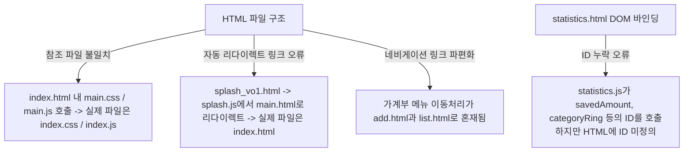
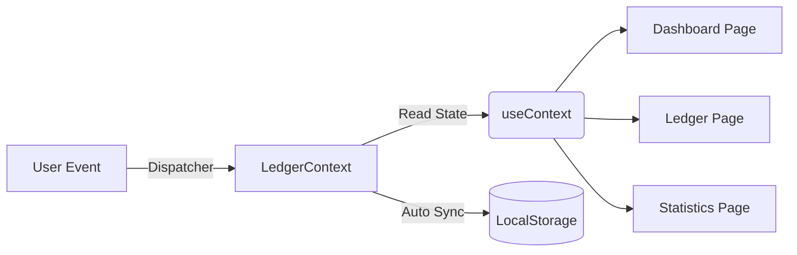
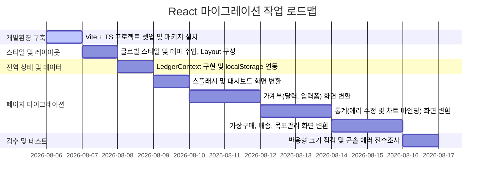

# React 변환 작업계획서 (SimSPEND)

이 계획서는 `org/` 폴더에 퍼블리싱된 기존 HTML, CSS, JavaScript, 이미지 리소스를 분석하고, 이를 React + Vite + TypeScript + styled-components 환경으로 마이그레이션하기 위한 작업 가이드라인입니다.

---

## 1. 원본 프로젝트 분석 결과

### A. 파일 디렉토리 구조 (`publising/org/`)
`org/` 폴더 내에 존재하는 퍼블리싱 리소스 파일은 다음과 같습니다.
* **HTML (8개)**: `add.html`, `delivery.html`, `index.html`, `mypage.html`, `pay.html`, `splash_vo1.html`, `statistics.html`, `target.html`
* **CSS (9개)**: `add.css`, `common.css`, `delivery.css`, `index.css`, `mypage.css`, `pay.css`, `splash.css`, `statistics.css`, `target.css`
* **JavaScript (9개)**: `add.js`, `data.js`, `delivery.js`, `index.js`, `mypage.js`, `pay.js`, `splash.js`, `statistics.js`, `target.js`

### B. 각 파일별 연결 및 매핑 관계
* **스플래시 화면 (`splash_vo1.html`)**:
  * 연결 리소스: `common.css`, `splash.css`, `splash.js`
  * 역할: 진입 시 브랜드 로고와 로딩 상태 표시 및 자동 리다이렉트
* **메인 대시보드 (`index.html`)**:
  * 연결 리소스: `common.css`, `main.css`(실제 index.css), FontAwesome CDN, `data.js`, `main.js`(실제 index.js)
  * 역할: 연속 스트릭 달력, 이번 주 지출 요약(막대 및 도넛 차트), 저축 목표 진행률, 퀵 메뉴 등 대시보드 뷰어
* **가계부 작성 및 조회 (`add.html`)**:
  * 연결 리소스: `common.css`, `add.css`, `data.js`, `add.js`
  * 역할: 월별 지출 합계 확인, 월간 달력 렌더링, 달력 날짜별 지출/수입 리스트 조회, 바텀시트 입력 폼을 통한 신규 트랜잭션 추가
* **통계 (`statistics.html`)**:
  * 연결 리소스: `common.css`, `statistics.css`, `data.js`, `statistics.js`
  * 역할: 전월 대비 총 지출, 예산 달성률, 이번 달 모은 금액, 목표 저축 진행률, 카테고리별 도넛 소비 그래프, 요일별 소비 차트, AI 소비 분석 리포트 제공
* **저축 목표 관리 (`target.html`)**:
  * 연결 리소스: `common.css`, `target.css`, `data.js`, `target.js`
  * 역할: 총 저축액 확인, 세부 저축 목표 리스트 렌더링(달성률, D-Day 표시), 목표별 액션 영역 분기(채우기, 팁 메시지 등), 새 목표 추가 FAB
* **마이페이지 (`mypage.html`)**:
  * 연결 리소스: `common.css`, `mypage.css`, `mypage.js`
  * 역할: 아바타 프로필 뷰, 일반 설정(알림, 다크모드 스위치), 고객 지원, 계정 관리
* **가상 구매 입력 (`pay.html`)**:
  * 연결 리소스: `common.css`, `pay.css`, `pay.js`, `../design/airpods-max.jpg`(상품 이미지)
  * 역할: 가상 쇼핑을 위한 상품명, 카테고리, 브랜드, 컬러, 가격, 메모 입력 및 가상 결제 실행
* **가상 배송 진행 (`delivery.html`)**:
  * 연결 리소스: `common.css`, `delivery.css`, `data.js`, `delivery.js`
  * 역할: 결제 완료 후 오늘 구매한 총액 조회 및 배송 진행 단계 스테퍼(준비 중 -> 배송 중 -> 도착 완료) 렌더링

---

## 2. 발견된 구조적 문제 및 주의사항

기존 퍼블리싱 소스를 면밀히 분석한 결과, React 변환 시 반드시 해결해야 할 **네 가지 오류 및 한계점**이 발견되었습니다.



### [중요] 퍼블리싱 원본의 구조적 오류 내용
1. **참조 파일명 매핑 불일치**:
   * `index.html`에서 `<link rel="stylesheet" href="main.css">`와 `<script src="main.js"></script>`를 불러오고 있지만, 실제 `org/` 폴더 내의 파일은 `index.css`와 `index.js`로 되어 있습니다.
   * `splash_vo1.html` 역시 `splash.js`에서 1.8초 뒤 이동할 다음 페이지를 `main.html`로 설정하고 있으나, 실제 대시보드 파일은 `index.html`입니다.
2. **하단 네비게이션 링크 불일치**:
   * `mypage.html`, `statistics.html`, `target.html`에서 하단 가계부 탭의 링크 주소가 `list.html`로 지정되어 있지만, 실제 가계부 파일은 `add.html`입니다. (`list.html`은 존재하지 않음)
   * `add.html`의 하단 메뉴 중 "더보기"가 `more.html`을 가리키고 있으나, 마이페이지는 `mypage.html`로 마이그레이션해야 합니다.
3. **통계 화면 (`statistics.html`) ID 누락 및 JS 런타임 에러**:
   * `statistics.js` 파일에서 `savedAmount` (모은 금액), `savingsProgressFill` & `savingsProgressPercent` (목표 저축 진행률), `categoryRing` & `categoryDonutValue` (카테고리 도넛 차트) 등의 DOM 엘리먼트 ID를 참조하여 조작하고 있으나, 실제 `statistics.html` 파일 내에는 해당 태그들에 ID가 전혀 정의되어 있지 않습니다.
   * 이로 인해 퍼블리싱 상태 그대로 브라우저 로딩 시 JavaScript 런타임 오류가 다량 발생합니다.
4. **네비게이션 구현 마크업의 이원화**:
   * `index.html`, `add.html`, `statistics.html`에서는 `nav_bar.svg` 이미지를 배경에 넣고 좌표를 통해 투명 투사 링크를 올린 `image-nav` 방식을 사용하고 있습니다.
   * `mypage.html`, `target.html`에서는 직접 SVG 코드를 나열하고 라벨 태그를 얹은 `bottom-nav` 마크업 방식을 사용하고 있어 두 방식이 혼재되어 있습니다.

> [!WARNING]
> React 변환 시, 위 파편화된 링크와 누락된 ID 요소들을 **리액트 Router 상태 및 Props 바인딩 구조**로 일원화하고, HTML 마크업을 단일 공통 컴포넌트(`BottomNav`, `Header`)로 재설계해야 합니다.

---

## 3. React 프로젝트 권장 폴더 구조

Vite, TypeScript, styled-components 기반의 권장 프로젝트 구조 설계입니다.

```
src/
├── @types/                 # TypeScript 공통 인터페이스 및 타입 정의
│   └── index.d.ts
├── assets/                 # 정적 리소스 (아이콘, SVG, 이미지 등)
│   ├── logo.svg
│   ├── nav_bar.svg
│   └── airpods-max.jpg
├── components/             # 공통 UI 컴포넌트
│   ├── BottomNav.tsx       # 통합 하단 네비게이션
│   ├── Header.tsx          # 공통 페이지 헤더
│   ├── Layout.tsx          # 최대 너비 430px 모바일 화면 프레임
│   └── Chart/              # 시각화용 차트 공통 컴포넌트
│       ├── BarChart.tsx
│       └── DonutChart.tsx
├── context/                # 전역 상태 관리
│   ├── LedgerContext.tsx   # 가계부 내역 & 가상 구매 데이터 Context
│   └── ThemeContext.tsx    # 다크모드 설정 관리 Context
├── pages/                  # 페이지 레벨 컴포넌트
│   ├── Splash.tsx          # 스플래시 화면 (splash_vo1.html 변환)
│   ├── Dashboard.tsx       # 메인 대시보드 (index.html 변환)
│   ├── Ledger.tsx          # 가계부 조회/작성 (add.html 변환)
│   ├── Statistics.tsx      # 소비 통계 분석 (statistics.html 변환)
│   ├── Target.tsx          # 저축 목표 관리 (target.html 변환)
│   ├── MyPage.tsx          # 마이페이지 설정 (mypage.html 변환)
│   ├── Purchase.tsx        # 가상 쇼핑 구매 (pay.html 변환)
│   └── Delivery.tsx        # 가상 배송 추적 (delivery.html 변환)
├── styles/                 # styled-components 글로벌 스타일 및 테마 정의
│   ├── GlobalStyle.ts      # 전역 CSS 초기화 (Reset) 및 폰트 설정
│   └── theme.ts            # 공통 색상, 마진, 쉐도우 등 디자인 시스템 상수
├── App.tsx                 # 라우터 매핑 및 전역 Provider 설정
└── main.tsx                # 엔트리 포인트
```

---

## 4. 페이지별 변환 계획

| 원본 HTML | React 페이지 컴포넌트 | 상태 및 핵심 로직 변환 계획 |
| :--- | :--- | :--- |
| **`splash_vo1.html`** | `src/pages/Splash.tsx` | - 1.8초 동안의 진행률 애니메이션 구현 (`useState`, `setInterval`) <br>- 완료 후 `useNavigate` 훅을 사용해 `/` (대시보드) 경로로 부드럽게 페이드 아웃 전환 |
| **`index.html`** | `src/pages/Dashboard.tsx` | - `LedgerContext`로부터 스트릭, 주간 합계, 저축 진행 상태를 받아와 화면 바인딩 <br>- 퀵 메뉴 목록 클릭 시 해당 가상 구매 서비스 페이지(`/pay`) 등으로 적절히 이동 |
| **`add.html`** | `src/pages/Ledger.tsx` | - 달력 연도/월 및 선택 일자 상태 관리 (`year`, `month`, `selectedDate`) <br>- FAB 버튼 클릭 시 입력 바텀시트 열기 상태 변환 (`isSheetOpen`) <br>- `handleSubmit` 이벤트 핸들러를 통한 신규 데이터 저장 및 즉시 리스트 갱신 |
| **`statistics.html`** | `src/pages/Statistics.tsx` | - `LedgerContext` 및 `SimSpendData` 데이터를 받아 요일별 지출 및 카테고리 도넛 차트 구현 <br>- 기존 누락되었던 HTML ID 매핑 에러를 JSX 변수 렌더링으로 자연스럽게 해결 |
| **`target.html`** | `src/pages/Target.tsx` | - 총 저축액 데이터 및 저축 목표 정보 리스트를 동적으로 바인딩 <br>- `actionType`('edit-fill', 'tip', 'celebrate')에 따른 조건부 렌더링 영역 구현 |
| **`mypage.html`** | `src/pages/MyPage.tsx` | - 다크모드 스위치 버튼 토글 구현 및 `ThemeContext` 전역 다크 상태 업데이트 연결 |
| **`pay.html`** | `src/pages/Purchase.tsx` | - 가격 인풋의 세 자릿수 콤마(,) 표시 및 실시간 갱신 로직 제어 컴포넌트 (`onChange` 핸들러) <br>- 가상 결제 제출 완료 시 전역 데이터 배열에 아이템 삽입 및 `/delivery` 페이지 전환 |
| **`delivery.html`** | `src/pages/Delivery.tsx` | - 가상 구매 완료 건에 대한 영수 금액 바인딩 <br>- 배송 진행 상태 데이터 구조(`steps`) 배열 기반의 스테퍼 렌더링 |

---

## 5. 공통 컴포넌트 분리 계획

1. **`Layout`**: 
   * 모바일 중심 서비스(최대 너비 430px) 구조에 부합하도록 전체 레이아웃을 감싸는 컨테이너 컴포넌트.
   * `margin: 0 auto; min-height: 100vh; box-shadow: 0 0 20px rgba(0,0,0,0.05);` 처리를 통해 통일된 화면 비율을 보장합니다.
2. **`Header`**:
   * 각 페이지 상단에 노출되는 뒤로가기 버튼(`useNavigate` 연동)과 페이지 명을 Props로 주입받아 통일되게 렌더링합니다.
3. **`BottomNav`**:
   * 기존 하단 메뉴 이미지 및 개별 HTML 파일의 상이함을 제거하고, React Router의 `<NavLink>`를 사용하여 사용자의 현재 위치에 매칭되는 액티브 탭 아이콘 색상 변경(예: 노란색 활성화)을 지원합니다.
4. **`DonutChart` & `BarChart`**:
   * 대시보드와 통계 화면에서 공통으로 쓰이는 SVG 기반 원형/막대그래프 차트 요소를 컴포넌트화하여 Props(`data`, `total`)에 따라 유연하게 형태가 변하도록 단일화합니다.

---

## 6. styled-components 변환 계획

기존 `common.css` 및 각 페이지별 CSS 속성을 styled-components 디자인 시스템으로 이식합니다.

### A. 테마 시스템 정의 (`src/styles/theme.ts`)
```typescript
export const lightTheme = {
  colors: {
    background: '#F8F9FC',
    cardBackground: '#FFFFFF',
    textPrimary: '#1E1F2E',
    textSecondary: '#8B8D9B',
    brandYellow: '#FFAE00',
    brandNegative: '#FF5C5C',
    brandPositive: '#2F9E6E',
    border: '#ECEDF1',
  },
  shadows: {
    card: '0 8px 24px rgba(0, 0, 0, 0.04)',
    bottomSheet: '0 -10px 30px rgba(0, 0, 0, 0.08)',
  }
};

export const darkTheme = {
  colors: {
    background: '#121218',
    cardBackground: '#1E1F2E',
    textPrimary: '#FFFFFF',
    textSecondary: '#8B8D9B',
    brandYellow: '#FFAE00',
    brandNegative: '#FF7D7D',
    brandPositive: '#43C68A',
    border: '#2D2E3C',
  },
  shadows: {
    card: '0 8px 24px rgba(0, 0, 0, 0.2)',
    bottomSheet: '0 -10px 30px rgba(0, 0, 0, 0.3)',
  }
};
```

### B. 전역 CSS 주입 (`src/styles/GlobalStyle.ts`)
* styled-components의 `createGlobalStyle`을 통해 폰트(Pretendard 혹은 Google Web Font), 모바일 바디 스크롤 영역, 터치 하이라이트 투명화 등의 전역 스타일 브라우저 초기화 작업을 적용합니다.

---

## 7. 상태 및 데이터 관리 계획

기존 `data.js` 파일에 캡슐화된 상태(state) CRUD 로직을 리액트 Context API 시스템으로 마이그레이션합니다.



* **전역 상태 셋업**: `LedgerContext.tsx` 파일 내에 `transactions` 와 `virtualPurchases` 상태를 구성합니다.
* **로컬 스토리지 동기화**:
  * 초기 로딩 시 `localStorage.getItem('simspend_transactions_v2')`가 존재하지 않을 때만 기존 `seedTransactions`를 기본 데이터로 로드합니다.
  * 트랜잭션의 추가/삭제가 발생하면 `useEffect` 훅이 반응하여 로컬 스토리지를 즉시 갱신(`setItem`)합니다.
* **계산 로직 셀렉터화**: 월별 총합 및 일별 사용량 계산 기능 등 `data.js`에 있던 연산 로직은 React 내에서 `useMemo`를 이용한 Selector 헬퍼 함수 형태로 감싸 불필요한 리렌더링을 방지합니다.

---

## 8. 라우팅 구성 계획

`react-router-dom` 라이브러리를 활용하여 단일 페이지 애플리케이션(SPA)의 네비게이션 구조를 생성합니다.

### A. 예상 라우팅 주소 맵
* `/splash` → 스플래시 로딩 페이지 (`Splash.tsx`)
* `/` → 메인 대시보드 페이지 (`Dashboard.tsx`)
* `/add` → 가계부 작성 및 리스트 조회 페이지 (`Ledger.tsx`)
* `/statistics` → 통계 및 분석 리포트 페이지 (`Statistics.tsx`)
* `/target` → 저축 목표 관리 페이지 (`Target.tsx`)
* `/mypage` → 설정 및 다크모드 제어 마이페이지 (`MyPage.tsx`)
* `/pay` → 상품 가상 구매 입력 페이지 (`Purchase.tsx`)
* `/delivery` → 가상 배송 진행 뷰 페이지 (`Delivery.tsx`)

### B. 특이 이동 흐름 구현 계획
* **스플래시 -> 메인 자동 이동**:
  * `Splash.tsx` 컴포넌트가 마운트되면 `setTimeout`으로 1.8초 카운트를 수행하며 UI 트랜지션을 실행합니다.
  * 시간이 경과하면 `navigate('/', { replace: true })`를 호출하여 사용자가 뒤로가기 버튼을 눌렀을 때 스플래시 화면이 다시 노출되는 문제를 방지합니다.
* **가상 결제 -> 배송 상태 조회 이동**:
  * `pay.html` 폼에서 가상 구매 저장 이벤트(`onSubmit`) 완료 즉시 토스트를 띄운 후 `navigate('/delivery')` 처리를 이어 동작의 완결성을 높입니다.

---

## 9. 이미지 및 정적 리소스 이전 계획

* **정적 이미지 관리**:
  * 원본 퍼블리싱 폴더 외부인 `design/` 폴더에 위치하던 `nav_bar.svg`, `airpods-max.jpg` 이미지 파일들은 React 프로젝트의 `public/assets/` 디렉토리로 안전하게 이전합니다.
* **SVG 리소스 관리**:
  * 웹 폰트(FontAwesome CDN) 의존성을 끊고, 아이콘 렌더링 안정성을 기하기 위해 HTML 내부의 SVG 아이콘 코드들을 리액트 컴포넌트 또는 개별 SVG 컴포넌트 파일로 모듈화하여 관리합니다.

---

## 10. TypeScript 타입 설계 계획

코드 안정성과 자동완성을 극대화하기 위해 `src/@types/index.d.ts`에 작성할 기본 데이터 타입 명세서입니다.

```typescript
// 가계부 거래 내역 항목 인터페이스
export interface Transaction {
  id: string;
  date: string;         // YYYY-MM-DD
  type: 'expense' | 'income';
  category: string;     // 식비, 교통, 쇼핑, 구독, 의료, 주거, 여행, 기타
  paymentMethod: string; // 카드, 현금, 계좌이체, 정기지출
  amount: number;
  memo: string;
  icon: string;
  createdAt: string;    // ISOString
}

// 가상 구매 항목 인터페이스
export interface VirtualPurchase {
  id: string;
  productName: string;
  category: string;
  brand: string;
  color: string;
  price: number;
  memo: string;
  status: 'payment_pending' | 'shipping' | 'delivered';
  createdAt: string;
}

// 저축 목표 인터페이스
export interface SavingsGoal {
  id: string;
  title: string;
  icon: string;
  target: number;
  saved: number;
  daysLeft: number | null;
  targetDate: string | null;
  statusLabel: string | null;
  actionType: 'edit-fill' | 'tip' | 'celebrate';
  tip: string | null;
}
```

---

## 11. 작업 순서



---

## 12. 단계별 검수 항목

* **검수 1단계: 빌드 무결성 검사**
  - TypeScript 컴파일 및 Vite 프로덕션 빌드 실행 (`npm run build`) 시 타입 미매칭이나 번들 크기 경고 발생 여부 확인
* **검수 2단계: 모바일 반응형 뷰포트 검사**
  - 모바일 화면 가로 최대 크기(`430px`) 밖으로 컴포넌트가 넘치지 않는지, 스크롤 유입 시 레이아웃 붕괴 현상이 없는지 확인
* **검수 3단계: 전역 상태 관리 및 영속화 점검**
  - 새로운 지출/수입 내역 등록 후 페이지 새로고침 시 캘린더 및 리스트 목록에 정상 유지되는지 LocalStorage 스토리지 검사
* **검수 4단계: 콘솔 런타임 에러 전수 점검**
  - 통계 탭(`Statistics.tsx`) 클릭 시 기존 퍼블리싱 마크업 상의 누락 ID 관련 `null` 에러가 더 이상 검출되지 않는지 디버깅 도구로 모니터링

---

## 13. React 변환 후 발생할 수 있는 문제와 예방 방법

1. **다크모드 깜빡임 현상(Flickering)**:
   * **원인**: React 컴포넌트 트리 마운트 이전에 로컬스토리지 다크모드 정보를 테마에 적용하지 못해 하얀 화면이 순간 노출될 수 있음.
   * **해방책**: `ThemeContext`에서 테마 상태 초기화 시 로컬스토리지 조회를 동기적으로 처리하여 초기 렌더링에 적재합니다.
2. **SVG 그래픽 리렌더링 부하**:
   * **원인**: 달력 셀 내부의 아이콘이나 하단 내비게이션 바 등 고화질 SVG 인라인 태그가 셀 선택에 따라 대거 리렌더링됨.
   * **해방책**: 아이콘 SVG 컴포넌트들은 `React.memo`를 사용하여 불필요한 가상 돔 연산을 억제합니다.
3. **가상 구매와 가계부 데이터 불일치**:
   * **원인**: 가상 결제 프로세스 완료 후 저장한 데이터와 가계부 실제 수입/지출 합산 연산 간에 격리가 모호해질 수 있음.
   * **해방책**: LocalStorage 저장 키(`simspend_transactions_v2` / `simspendVirtualPurchases`)를 독립적으로 확실히 분리하고 Context 단에서 책임 범위를 구분해 관리합니다.
